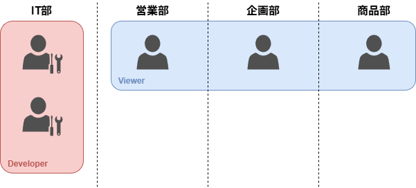
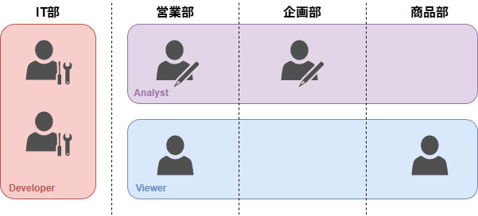
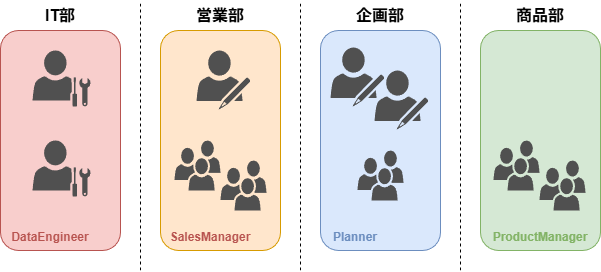

## ロール設計

Snowflakeはセキュリティモデルとして、ロールベースのアクセス制限(RBAC)を採用しています。
ユーザーそれぞれの役割に応じたロールが割り当てられ、そのロール毎にアクセスできるオブジェクトや実行できるアクションが制限されます。
データ分析基盤の開発にあたっては、これらをどのように割り当てるかの設計も必要となってきます。

ロール設計はセキュリティ的な観点は当然ながら、保守性の観点、スケーラビリティ担保の観点でも重要です。

ユーザーによる自由分析のための基盤を提供するという目的において、基本的には"公開したデータセットはその後段で自由に利用"されます。
すなわちロール設計が不適当であると、本来見て欲しくないデータ(加工前の生データ、実験的な加工が施されたデータ、そもそもの信頼性が担保されていないデータ)が
意図しない形で利用され、最悪の場合定常的なビジネスのワークフローに組み込まれてしまう可能性が生じます。
こうなってしまった場合、データ分析基盤として品質を担保すべき界面が曖昧になる上、これらを是正しようにも後追いでの利用停止・プロセス改修には想定外のコストがかかってしまいます。

また不適当なCRUD権限が付与されている場合は、開発者・ユーザー双方意図しないところでデータの変更・削除が発生し、データセットの可用性・信頼性が著しく毀損されてしまいます。

ロール設計においては 運用容易性とセキュリティ・保守性・スケーラビリティ のトレードオフを提唱します。
ロールを細かく分けるほどセキュリティ・保守性が高まりデータ活用組織をスケールする際の微調整も効かせやすくなるのですが、一方でロール運用にかかるコストが大きくなる といった具合です。

これらの観点から、ここではデータ活用のスケールに応じた3種類の設計思想を紹介します。

### 最小構成

PoC的に開発したデータ分析基盤であっても、最小限のロール設計は実施する必要があります。
少なくとも`DEVELOPER`・`VIEWER`の2種類は確保しておき、データ加工を行う人・利用する人の区別は必須でしょう。

間違っても全てのユーザーが作成・編集・削除を行えるような権限設定は避けましょう。
開発当初は緩い権限のロールを多くのユーザーに配る設計になりがちですが、この状態は何としても早めに脱却することをお勧めします。
ロール設計の変更はユーザー全体への影響が生じるため規模が大きくなってからの変更はリスクが非常に高く、
"明らかにセキュリティ・拡張性・保守性に課題があるが解消できない"という心理的負担の大きい状態が発生してしまいます。

### リテラシー・職責軸

データユーザーが小規模な間はリテラシー・職責軸でのロール設計がお手軽です。
粒度としては データの加工をする人/分析する人/見るだけの人 と浅めのレイヤー分けにして、組織の区別なくロールを付与する設計思想です。

データ分析基盤の開発者には`DEVELOPER`ロールを付与し全体のCRUD権限を与えつつ、リテラシーが十分に高く分析業務を独力で実施できるユーザーには自由分析向けの`ANALYST`、
リテラシー不十分または簡易的な閲覧のみで十分なユーザーには`VIEWER`を与えるといった設計です。
例としてディメンショナルモデリングに従ったデータセットを構築している場合、`ANALYST`にはファクト・ディメンションテーブルの閲覧権限を、
`VIEWER`にはデータエンジニア側で加工済のマートテーブルの閲覧権限のみを付与する、といった具合になります。

ある程度の規模のユースケースまでは過不足なく理解しやすい設計だと思うのですが、
組織に応じて使わせたいデータセットや機能が変わる という状態には追従できません。

### 組織・ドメイン軸

組織全体でのデータ活用が見込める場合は、組織・ドメイン軸のロール設計が好ましいです。
すなわち、組織ごとに見れるデータ・使える機能を定義する という設計思想です。

社内のデータ活用が進み取り扱うデータが増えるにつれ、ユーザーごとに見せてよい情報・見せられない情報が細かく分かれてゆきます。
ビジネスクリティカルな情報ほど意思決定への寄与度が大きい一方で、見せられる範囲は厳しく絞られて然るべきです。
こういったケースでも、保守性を維持しつつ現実的に最小粒度の権限管理が行えるのが組織・ドメイン軸でのロール設計となります。

また近年のデータベースの多くは動的データマスキングやRLS(Row-Level Security)など、カラム単位・レコード単位でのアクセス制限機能を有しており、Snowflakeも例に漏れず同様の機能があります。
データの責任と組織・ドメインをきれいに紐づけたロール設計を行うことでこれらの機能を有意義に生かすことができ、より安全かつ取り回しのよいデータ分析基盤を構築することができます。

ユーザーの意思決定の正確性・迅速性を高めつつ安全性を担保するというデータ分析基盤の責務を考えると最も理想的な設計ではあるのですが、いかんせん組織体制の変更や配置転換に追従するコストが馬鹿にならず、常に理想的な状態を維持するのがなかなかに大変な設計ではあります。

### 選定基準

- 運用容易性 ⇔ セキュリティ・保守性・スケーラビリティ

|     |        設計方針        |                       メリット                       |                                デメリット                                |
| --- | ---------------------- | ---------------------------------------------------- | ------------------------------------------------------------------------ |
| 梅  | **最小構成**           | 開発・運用コスト最小                                 | 細かいアクセス制御が行えない                                             |
| 竹  | **リテラシー・職責軸** | 運用コストを押さえつつ、インシデントリスクを削減可能 | セキュリティ観点では片手落ち ユースケースのスケーラビリティが少し劣る |
| 松  | **組織・ドメイン軸**   | 現実的な範囲で最小粒度のアクセス制御が可能           | 運用コスト大                                                             |
